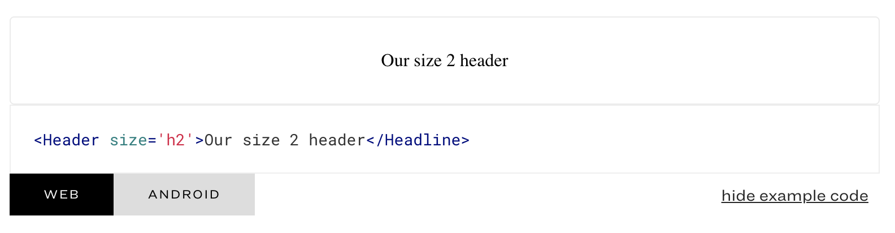
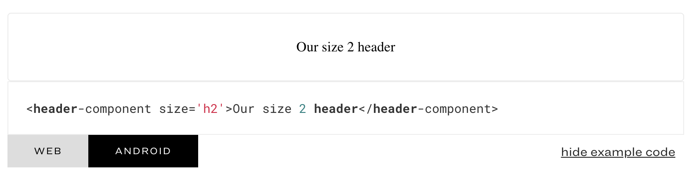

# Code Tabbed

While Catalog already comes with a specimen for displaying blocks of Code, it does not allow for having different tabbable views of them. The use case for this is for a product that might use the same Design System between Web, iOS, and Android - the actual mechanics of how things work are the same, but the inclusion of the component may be slightly different.

## Installation

### Install this package

`npm install --save-dev @upstatement/catalog-code-tabbed`

### Add the Specimen to Catalog

Within your `catalog/index.tsx` file, you'll need to include the specimen itself. This will let Catalog know to look for it and to parse things using it.

```
import * as React from 'react';
import * as ReactDOM from 'react-dom';
import { Catalog, pageLoader } from 'catalog';
import * as codetabbed from '@upstatement/catalog-code-tabbed';

...

ReactDOM.render(
  <Catalog
    title="Catalog Design System"
    logoSrc="static/assets/img/logo_short.svg"
    pages={[]}
    specimens={[
      codetabbed,
    ]}
...
```

## Specimen Usage

You can add the specimen to any markdown file used by your catalog system. For our purposes, I'll be assuming a fake `header.md` file with a fake Header component.

````
```react
<Header size='h2'>Our size 2 header</Header>
```

```codetabbed
tabs: [web, android]
web: <Header size='h2'>Our size 2 header</Headline>
android: <header-component size='h2'>Our size 2 header</header-component>
```
````

In this above example, our component has the same properties, and functions the same, but for arbitrary reasons that I just made up, is named slightly different for our Android app than it is for our web app.

Rather than having simply "web", "android", "ios" as options, I wanted to leave it more broad - perhaps you have names for your different products. As such, you can specify whatever you want for the tab names (and associated properties), _so long as they are consistent_. If you do not include content for a specified tab, the component will crash. If you do not include the tab in the list, it will not be included. 

In short: If you want a tab for `banana`, include it in the `tabs` list, and then add a `prop` for it, and it'll be there.

## Note: Multiline Snippets

It is possible to include Multiline snippets, you simply need to open the property with a | symbol, like this:

````
```codetabbed
  tabs: [android, web]
  android: <Header size="h2" anchorTag="true" id="header-contact">Contact Us</Header>
  web: |
    <Header 
      size="h2" 
      anchorTag="true" 
      id="header-contact"
    >
      Contact Us
    </Header>
```
````

### Output

And here's an image of how it should be output into Catalog. 
 
First Tab selected:


Second Tab selected:

