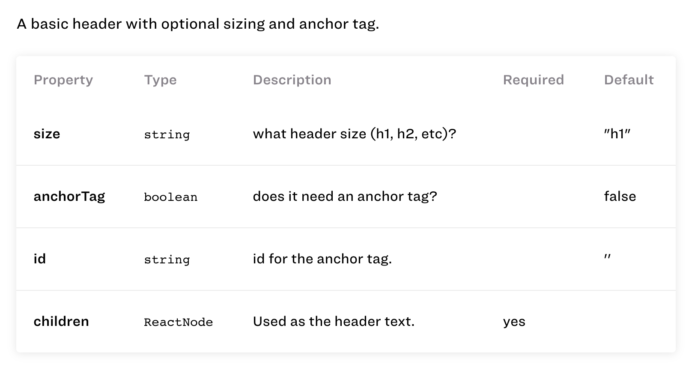

# Code Docs

This custom specimen can be used to automatically generate simple code documentation within Catalog from the comments written and propTypes specified in your React component.

## Installation

### Install this package

`npm install --save-dev @upstatement/catalog-code-docs`

### Add the Specimen to Catalog

Within your `catalog/index.tsx` file, you'll need to include the specimen itself. This will let Catalog know to look for it and to parse things using it.

```
import * as React from 'react';
import * as ReactDOM from 'react-dom';
import { Catalog, pageLoader } from 'catalog';
import * as codedocs from '@upstatement/catalog-code-docs';

...

ReactDOM.render(
  <Catalog
    title="Catalog Design System"
    logoSrc="static/assets/img/logo_short.svg"
    pages={[]}
    specimens={[
      codedocs,
    ]}
...
```

## Usage

For the purposes of these instructions, I'll be using a fake Header component, but this should work for anything.

### Add your Component to Catalog.

In order for the code docs specimen to work, you must also let Catalog import your Component in its raw (read: uncompiled) form so that DocGen can actually get to the comments before any parsing or minifying occurs.

In your `catalog/index.tsx` file, you'll need to make sure to include your Component in two different ways.

```
import * as React from 'react';
import * as ReactDOM from 'react-dom';
import { Catalog, pageLoader } from 'catalog';
import * as codedocs from '@upstatement/catalog-specimens/code-docs';

import { Header } from '/components/Header';

...
ReactDOM.render(
  <Catalog
    title="Catalog Design System"
    logoSrc="static/assets/img/logo_short.svg"
    pages={[
      {
        path: '/header',
        title: 'Header',
        content: pageLoader(() => import('./pages/header.md')),
        imports: {
          Header: Header,
          Header: require('!raw-loader!components/Header'),
        },
      },
    ]}
    specimens={[
      codedocs,
    ]}
  ...
```

### Add the comments to your Component

Our simple Header component has an optional "size" and may take an ID for being an anchor point for navigation. There are two types of comments used here - the first at the top of the function, and the latter within the Header Props. These will both be picked up by the Code Docs specimen.

```
import React, { ReactNode } from 'react';

/**
 * A basic header with optional sizing and anchor tag.
 */
export function Header({
  children,
  size = "h1",
  anchorTag = false,
  id = '',
}: HeaderProps) {
  const HeaderTag = size as 'div';

  if (anchorTag) {
    return (
      <HeaderTag><a id={id}></a>{children}</HeaderTag>
    )
  }

  return (
    <HeaderTag>{children}</HeaderTag>
  )
}

export type HeaderProps = {
  /** what header size (h1, h2, etc)? */
  size?: string;
  /** does it need an anchor tag? */
  anchorTag?: boolean;
  /** id for the anchor tag. */
  id?: string;

  /** Used as the header text. */
  children: ReactNode;
};
```

### Specimen Usage

Then we drop this into our `header.md` file:

````
```
codedocs
  component: HeaderRaw
  typescript: true
```
````

Note that I'm using typescript: true, because my Header component uses TypeScript. Your component may not, or there may be inconsistencies between those that do and those that don't. 

### Output

And here's an image of how it should be output into Catalog. Our overall comment comes up first, followed by a table that gives a breakdown of the different properties, whether they're required or have defaults, etc.
 

