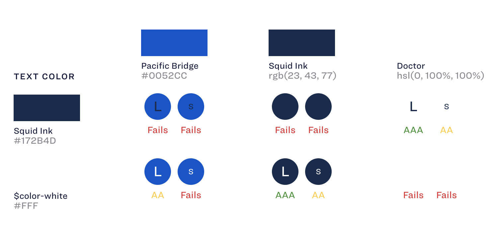

# Color Block

The Catalog specimen for a Color Palette is quite useful - but one thing that I find lacking from it is handling Accessibility display. The idea behind this specimen is to take in a variety of colors, and show how they should and should not be paired.

## Installation

### Install this package

`npm install --save-dev @upstatement/catalog-color-block`

### Add the Specimen to Catalog

Within your `catalog/index.tsx` file, you'll need to include the specimen itself. This will let Catalog know to look for it and to parse things using it.

```
import * as React from 'react';
import * as ReactDOM from 'react-dom';
import { Catalog, pageLoader } from 'catalog';
import * as colorblock from '@upstatement/catalog-color-block';

...

ReactDOM.render(
  <Catalog
    title="Catalog Design System"
    logoSrc="static/assets/img/logo_short.svg"
    pages={[]}
    specimens={[
      colorblock,
    ]}
...
```

## Specimen Usage

You can add the specimen to any markdown file used by your catalog system. For our purposes, I'll be assuming a genertic `color.md` file that goes over all of our brand guidelines. 

````
```colorblock
  backgroundColors: [
    { name: 'Pacific Bridge', color: '#0052CC' },
    { name: 'Squid Ink', color: 'rgb(23, 43, 77)' },
    { name: 'Doctor', color: 'hsl(0, 100%, 100%)' },
  ]
  foregroundColors: [
    { name: 'Squid Ink', color: '#172B4D' },
    { name: '$color-white', color: '#FFF' },
  ]
```
````

As you can see, the structure for this is quite similar to that of a color palette. The biggest difference is that instead of simply having `colors`, it's split up into `background` and `foreground`. This distinction is in place to keep us from having to generate pairings that would never occur - for instance, matching multiple background colors. 

As with color palette, the name is completely optional. Common uses for this would be things like a more easily used term (for instance, "Concrete" when you have various shades of grey), or even an SCSS variable such as `$color-grey43`. 

The color field accepts 3 digit hex, 6 digit hex, rgb, and hsl. It does not currently parse hsla or rgba. 

## Output

The specimen outputs a Chart that creates the combinations, each listed with a possible scoring: `AAA (green)` means it passes for AA and AAA. `AA (yellow)` means it passes for AA but not AAA. `Fail (red)` means it does not pass either AA or AAA.

Additionally, each example uses two sizes, 20px and 12px, because the text size can often be the deciding factor for some colors that are close together.

The below example uses the color guidelines from [Atlassian](https://atlassian.design/guidelines/brand/color).

